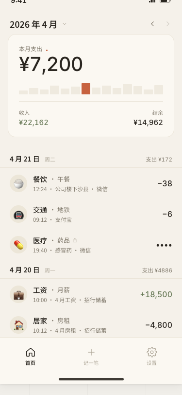
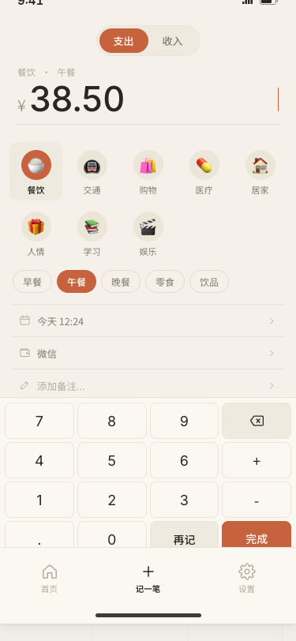
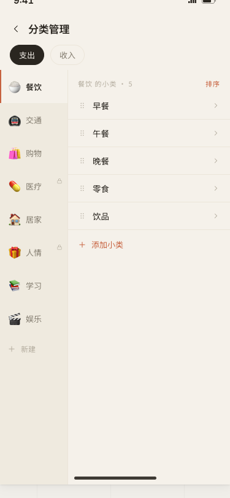
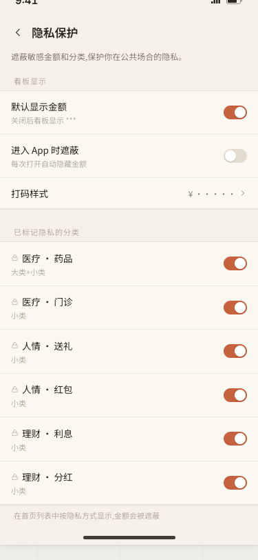
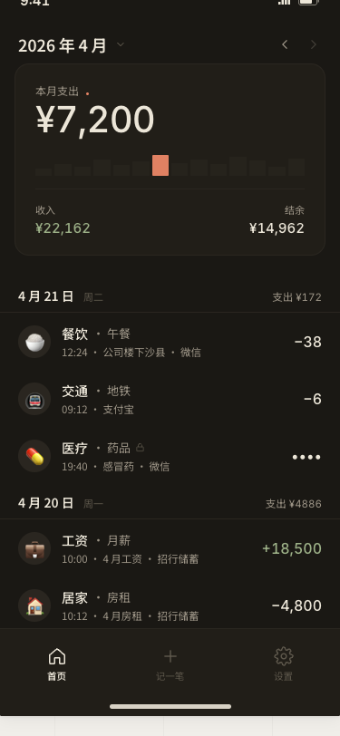
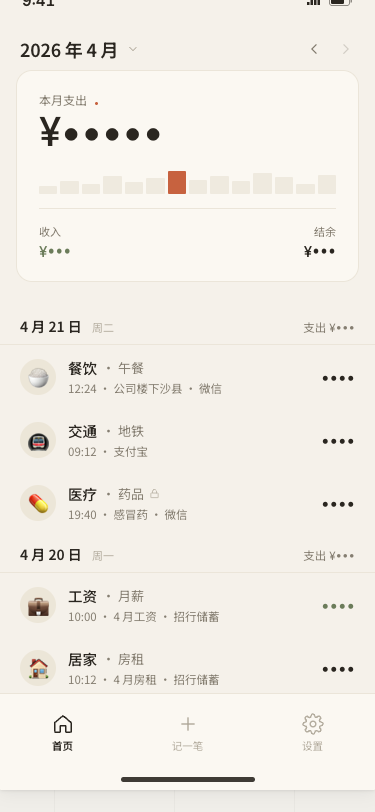

# MoneyTracker

一款极简风格的个人记账 App，使用 **Kotlin Multiplatform + Compose Multiplatform** 构建，Android / iOS / Desktop 三端共享代码和 UI。

暖灰配色，手写矢量图标，SQLDelight 本地持久化。

---

## 原型截图

> 以下截图来自开发前的 HTML 交互原型，呈现最终设计目标。

<p align="center">
  
  
  
  
</p>

<p align="center">
  
  
</p>

---

## 功能

### 已实现（一期 + 二期）

- **首页看板** — 月度支出 / 收入 / 结余，按日分组流水，每日支出柱状图
- **记一笔** — 支出 / 收入切换，分类 + 小类选择，账户选择，时间 / 备注填写
- **编辑 / 删除记录** — 首页点击记录进入编辑模式，二次确认删除
- **月份切换** — 按月查看历史记录，带全年汇总的月份选择器
- **隐私遮蔽** — 隐私分类（医疗、人情、理财）金额自动遮蔽为 ••••
- **账户管理** — 增删改查账户，设置默认账户，关联记录检查
- **分类结构** — 8 个支出大类 + 4 个收入大类，各含多个小类，首启自动初始化

### 计划中

- 分类管理 CRUD（排序、编辑、新建）
- 隐私全局开关 + 应用锁（BiometricPrompt / Face ID）
- 主题切换（跟随系统 / 浅色 / 深色）
- 自动记账规则（定时触发，支持按周 / 按月日 / 按月第几个周几）
- CSV / JSON 导出，iCloud / Google Drive 备份

---

## 技术栈

| 层次 | 技术 |
|------|------|
| 跨平台框架 | Kotlin Multiplatform (KMP) |
| UI | Compose Multiplatform |
| 数据库 | SQLDelight 2.1 — Android / iOS / JVM 三端驱动 |
| 导航 | Voyager (TabNavigator + Navigator) |
| 状态管理 | ViewModel + StateFlow + Flow.combine |
| 时间处理 | kotlinx-datetime（本地时区感知）|
| 图标 | 手写 ImageVector（20+ 个线性图标）|

---

## 构建运行

### Android
```shell
./gradlew :composeApp:assembleDebug
```

### Desktop (JVM)
```shell
./gradlew :composeApp:run
```

### iOS
用 Xcode 打开 `/iosApp` 目录运行。

---

## 项目结构

```
composeApp/src/commonMain/
├── data/
│   ├── Repositories.kt       # Category / Account / Record / Preference
│   ├── DomainTypes.kt        # 领域类型（RecordDetail / DayGroup / MonthSummary）
│   ├── DefaultDataSeeder.kt  # 首启数据初始化
│   └── Time.kt               # 时区工具
├── db/                       # SQLDelight expect/actual 工厂
├── di/AppContainer.kt        # 依赖注入容器
├── ui/
│   ├── home/                 # 首页 + HomeViewModel
│   ├── entry/                # 记一笔 + EntryViewModel
│   ├── settings/             # 设置各页 + AccountsViewModel
│   ├── nav/AppScaffold.kt    # 底部 Tab + 页面路由
│   └── components/           # 公共组件 + LineIcons
└── sqldelight/               # .sq 文件（6 张表）
```
